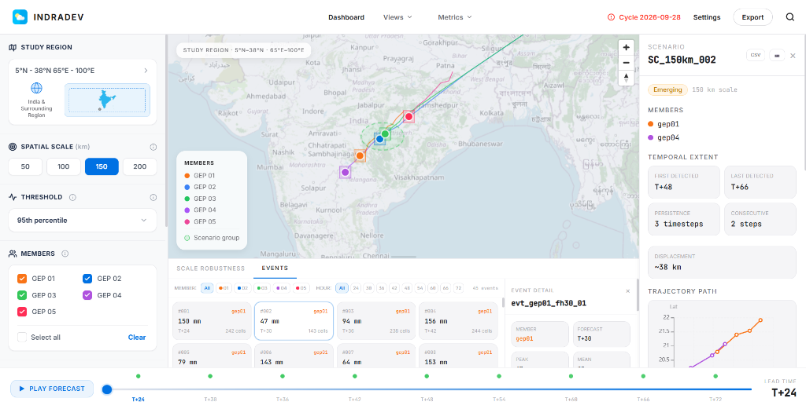

# IndraDev

> **AI Tracks. AI Groups. Humans Analyze.**

A spatio-temporal ensemble intelligence system for extreme precipitation that detects persistent member-consistent spatial scenarios within GEFS forecasts.


**Frontend (Live Dashboard):** [https://deploy-indradev.vercel.app](https://deploy-indradev.vercel.app)  
**Backend API (Live Server):** [https://deploy-indradev.onrender.com/docs](https://deploy-indradev.onrender.com/docs)

| Field | Details |
|---|---|
| **Hackathon** | Smart India Hackathon 2026 |
| **Team Name** | NoMoreCode |
| **Team ID** | 173542 |
| **Problem Statement ID** | 26078 |
| **Problem Statement Title** | AI-Driven Spatio-Temporal Tracking of Extreme Weather Anomalies in Medium-Range Forecasts |
| **Theme** | Disaster Management |
| **Category** | Software |

---

## What It Does

Instead of showing only ensemble spread or a messy "spaghetti plot", this system identifies when forecast members begin forming distinct, persistent spatial scenarios for extreme precipitation. 

It tracks precipitation objects independently inside each ensemble member, builds cross-member geographic proximity graphs to group them, and then analyzes the temporal persistence of those exact member groups across the forecast horizon.

It is built for meteorological researchers and operational forecasters who need to determine whether a diverging forecast represents random noise or the emergence of a structurally robust alternative weather scenario.

### Key Capabilities

- **Member-Consistent Grouping**: Dynamically discovers groups of GEFS members that are predicting the same spatial extreme event at the same time.
- **Persistence Tracking**: Measures how long a specific scenario structure survives across forecast timesteps (e.g., T+54 → T+66).
- **Scale Robustness Analysis**: Tests whether a scenario holds together across multiple spatial grouping thresholds (50km, 100km, 150km, 200km) using an interactive robustness matrix.
- **Atmospheric Diagnostics**: Extracts 850 hPa (Wind/Temp), 500 hPa Height, and CAPE data for scenario groups to help forecasters diagnose the associated atmospheric state.
- **Live GEFS Ingestion**: Includes operational scripts to fetch real-time 0.25° GRIB fields directly from NOAA NOMADS AWS servers.
- **Interactive UI**: A polished React dashboard featuring MapLibre GL JS mapping, Framer Motion animations, Apache ECharts telemetry, a playable forecast timeline, and one-click PPT/CSV data exports.

---

## Screenshots

### SIH Dashboard (IndraDev & Atmospheric Diagnostics)


---

## Architecture

```
weather-anomaly/
|-- backend/                     # FastAPI + Python
|   |-- app/
|   |   |-- api/                 # REST endpoints (routes.py)
|   |   |-- schemas/             # Pydantic request/response schemas
|   |   \-- services/            # Caching and data loading (data_service.py)
|   |
|   |-- scientific/              # Core Intelligence Engine
|   |   |-- precipitation.py     # 24h rolling accumulation logic
|   |   |-- event_detection.py   # 95th percentile thresholding & masking
|   |   |-- tracking.py          # Hungarian algorithm (IoU/Distance/Intensity)
|   |   |-- association.py       # Cross-member pairing heuristics
|   |   |-- scenario_detection.py# NetworkX geographic proximity grouping
|   |   |-- persistence.py       # Temporal consistency analysis
|   |   |-- scale_analysis.py    # Multi-scale threshold testing
|   |   \-- atmospheric.py       # Diagnostic data generation
|   |
|   \-- venv/                    # Python environment
|
|-- frontend/                    # React + Vite + TypeScript
|   \-- src/
|       |-- components/          # UI (Timeline, Drawers, Charts, Panels)
|       |-- map/                 # MapLibre GL implementation
|       |-- hooks/               # Data fetching & Replay state
|       \-- services/            # API client
|
|-- data/
|   |-- raw/                     # Downloaded GEFS GRIB files
|   |-- processed/               # Precomputed offline outputs
|   \-- demo/                    # SIH validated Parquet dataset (loads in 0ms)
|
\-- scripts/
    |-- fetch_live_gefs.py       # NOAA NOMADS AWS ingestion
    |-- preprocess.py            # GRIB to Parquet offline pipeline
    \-- build_demo_dataset.py    # Generates the validated SIH demo dataset
```

---

## Intelligence & Scoring

### 1. The Core Scientific Pipeline

| Stage | Method | Purpose |
|---|---|---|
| **Event Detection** | 95th Percentile | Extracts connected extreme regions (≥10 grid cells) from rolling 24h precipitation accumulations. |
| **Within-Member Tracking** | Hungarian Assignment | Tracks a storm's trajectory across time *within* a single member using Centroid Distance, IoU, and Area similarity. |
| **Cross-Member Graphing** | NetworkX Proximity | Links storms across different members at the same forecast hour if they fall within a defined spatial threshold (e.g., 50km). |
| **Persistence Engine** | Set Intersections | Identifies when the exact same subset of members remains grouped together across consecutive forecast hours. |

### 2. Scenario Classification

Scenarios are dynamically classified based on their temporal lifespan:
- **Persistent:** Structure survives for ≥3 consecutive timesteps.
- **Emerging:** Structure survives for 2 consecutive timesteps.
- **Scale-sensitive:** Structure appears multiple times, but breaks apart geographically.
- **Transient:** Fleeting alignment that immediately dissipates.

---

## API Endpoints

| Method | Endpoint | Description |
|---|---|---|
| `GET` | `/api/cycles` | Lists available forecast cycles and summary counts. |
| `GET` | `/api/forecast/{hour}` | Returns spatial state (events, tracks, groupings) for the map at a specific time. |
| `GET` | `/api/scenarios` | Lists all detected scenarios, filterable by scale and minimum persistence. |
| `GET` | `/api/scenarios/{id}` | Full detail profile for a specific scenario structure. |
| `GET` | `/api/scenarios/{id}/trajectory` | The geographic track points for all members in the scenario. |
| `GET` | `/api/scenarios/{id}/atmosphere` | The associated atmospheric diagnostics (850hPa, 500hPa, CAPE). |
| `GET` | `/api/scale-analysis` | Robustness matrix data across 50, 100, 150, and 200 km scales. |

---

## Quick Start

### Prerequisites

- Python 3.10+
- Node.js 18+

### 1. Backend

```bash
cd backend

# Create virtual environment
python -m venv venv
.\venv\Scripts\activate        # Windows
# source venv/bin/activate     # macOS/Linux

# Install dependencies
pip install -r requirements.txt

# Start the API server
python -m uvicorn app.main:app --reload
```

The backend runs at **http://127.0.0.1:8000**.
- Swagger UI: http://127.0.0.1:8000/docs

### 2. Frontend

```bash
cd frontend

# Install dependencies
npm install

# Start the dev server
npm run dev
```

The frontend runs at **http://localhost:5173**.

---

## Data Operations

The application currently reads from ultra-fast Parquet files in `data/demo/` to guarantee instantaneous loading during the live presentation.

To run the pipeline on real data:
1. Run `python scripts/fetch_live_gefs.py` to download the latest NOAA GRIB files to `data/raw/`.
2. Run `python scripts/preprocess.py` to run the scientific pipeline and output to `data/processed/`.
3. Update `data_service.py` to point to the `processed/` directory.

---

## Tech Stack

| Layer | Technology |
|---|---|
| **Backend** | Python 3.10+, FastAPI, Uvicorn |
| **Scientific Engine** | xarray, cfgrib, pandas, scipy, shapely, networkx |
| **Data Storage** | Apache Parquet |
| **Frontend** | React 19, TypeScript, Vite, Tailwind CSS |
| **Maps & Charts** | MapLibre GL JS, Apache ECharts |
| **Styling** | Minimalist Light Theme (Cloudflare-inspired), Tailwind CSS, Framer Motion |

---

## Statutory Caveats

1. **Statistical Significance:** A member-label permutation test was performed on the demo cycle. While the persistence of certain sub-groups (e.g. `gep02+gep03`) is suggestive, it does not strictly reach statistical significance under the null hypothesis at this sample size.
2. **Atmospheric Causality:** The atmospheric variables (Temperature, Wind, 500hPa Height, CAPE) provided in the dashboard are *associated diagnostics* only. They do not represent a causal explanation for the ensemble branching. 

> This platform identifies spatial groupings for authorised meteorological verification. It does not output deterministic weather predictions.

---

## License

MIT
